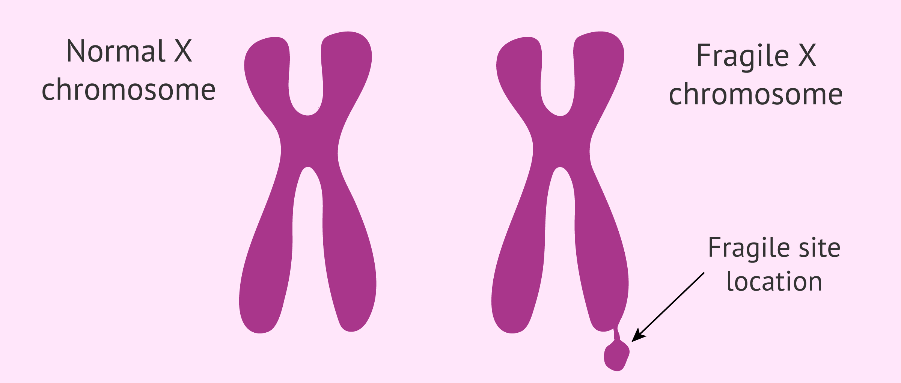
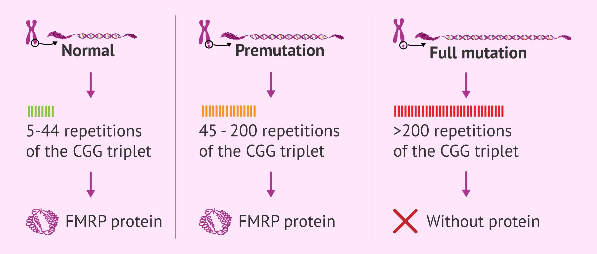
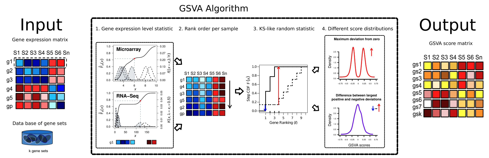
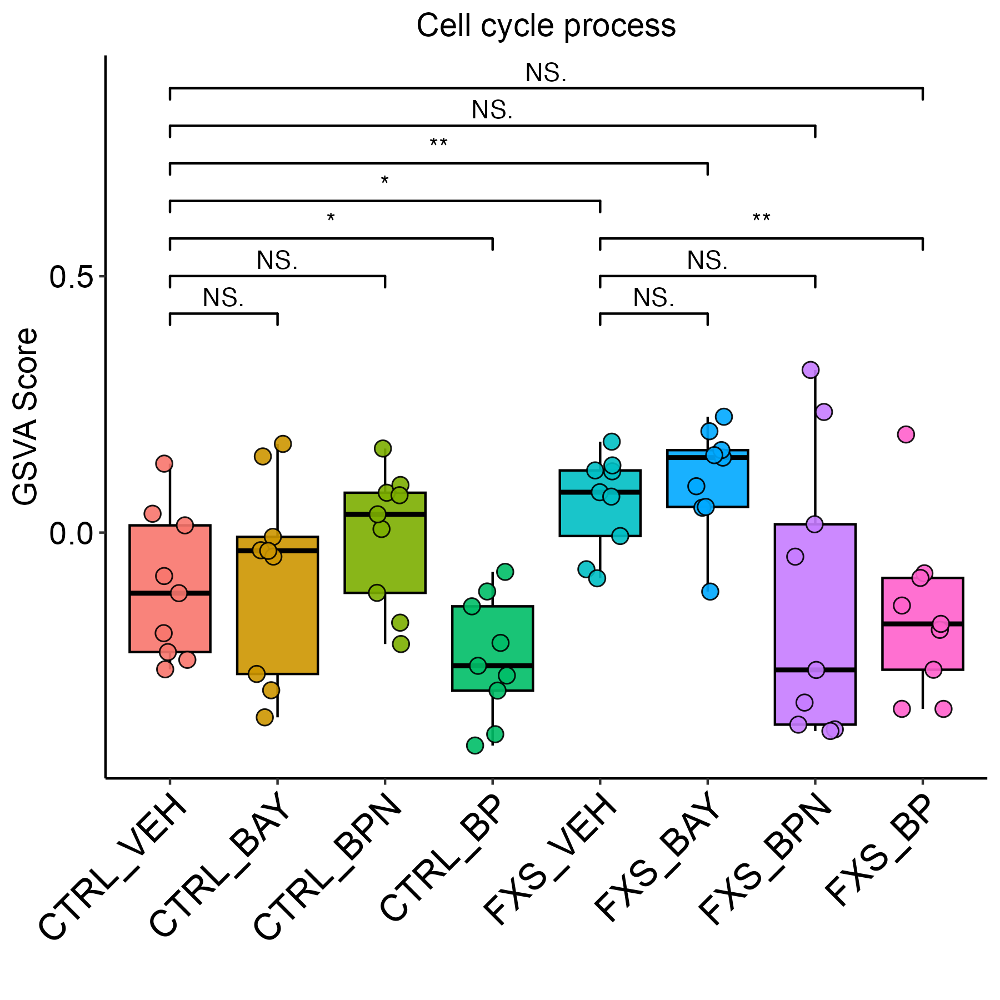

# Fragile X syndrome

Fragile X syndrome (FXS), also known as Martin-Bell syndrome, is a genetic disorder that manifests mainly through mental retardation and developmental problems martin-Bell syndrome fragile X syndrome (FXS), is a genetic disorder that manifests itself mainly through mental retardation and developmental problems.

Source: https://www.invitra.com/en/fragile-x-syndrome/

# What is the Fragile X Syndrome?
Fragile X syndrome is an X-linked genetic disease caused by a mutation in the FMR-1gene. It is a change in the DNA sequence that causes the absence of a protein called FMRP1 (Fragile X Mental Retardation Protein). This protein is essential for normal brain development, which explains the problems in the development of people affected by this syndrome.

The name of the syndrome is due to the fact that this mutation causes a small break in one of the arms of the X chromosome known as the fragile site. This breakage is only apparent when the chromosome is treated under specific conditions in the laboratory.

Source: https://www.invitra.com/en/fragile-x-syndrome/fragile-x-chromosome/

## Causes of Fragile X Syndrome

This genetic disease is caused by a mutation in the FMR-1 gene sequence. This change causes the protein for which this gene codes(FMRP1) is not produced and does not perform its function.

Within the FMR-1 gene there is a specific segment characterized by the repetition of a specific genetic sequence: the CGG trinucleotide. This sequence is present between 5 and 40 times in people not affected by Fragile X syndrome.

Source: https://www.invitra.com/en/fragile-x-syndrome/number-repetitions-syndrome-x-fragil/

# Analysis of the Fragile X Syndrome

## Naive Test

We compare the GSVA score across different disease situaion and the drug treatment. The GSVA score is a measure of the gene expression level of the one specific pathway.

And we use t-test to compare the GSVA score between different disease situation and drug treatment.

## Mix-effect model

We model **GSVA scores** using a **mix-effects model**, incorporating **fixed effects** for disease status (FXS), drug treatments, and their **interactions**, along with a **random intercept** for individual-level variability:

$$
\begin{aligned}
Y_{ij} =\ & \beta_0 + \beta_1 X_{\text{FXS}} + \beta_2 X_{\text{Drug\_BAY}} + \beta_3 X_{\text{Drug\_BPN}} + \beta_4 X_{\text{Drug\_BP}} \\
          & + \beta_5 (X_{\text{FXS}} \times X_{\text{Drug\_BAY}}) + \beta_6 (X_{\text{FXS}} \times X_{\text{Drug\_BPN}}) + \beta_7 (X_{\text{FXS}} \times X_{\text{Drug\_BP}}) \\
          & +\ b_i + \varepsilon_{ij}
\end{aligned}
$$

### **Model Components**

- $Y_{ij}$: GSVA score for individual $i$ under condition $j$.

- **Fixed Effects:**
  - $X_{\text{FXS}}$: Disease indicator (1 for **FXS**, 0 for **CTRL**).
  - $X_{\text{Drug\_BAY}}, X_{\text{Drug\_BPN}}, X_{\text{Drug\_BP}}$: Drug treatment indicators (vehicle is the reference).
  - **Interaction Terms:**
    - $X_{\text{FXS}} \times X_{\text{Drug\_BAY}}$: Interaction between FXS and BAY treatment.
    - $X_{\text{FXS}} \times X_{\text{Drug\_BPN}}$: Interaction between FXS and BPN treatment.
    - $X_{\text{FXS}} \times X_{\text{Drug\_BP}}$: Interaction between FXS and BP treatment.

- **Random Intercept:**
  - $b_i \sim \mathcal{N}(0, \tau^2)$: Individual-specific random intercept capturing baseline variability.

- **Error Term:**
  - $\varepsilon_{ij} \sim \mathcal{N}(0, \sigma^2)$: Residual error term.

This model allows us to estimate not only the **main effects** of disease and drug treatments but also **how drug responses differ between FXS and CTRL individuals**. Interaction terms capture whether the drug effect is **modified by disease status**, which is essential for understanding differential pathway responses.

### Hypothesis Testing: Drug Effects Compared to CTRL in the FXS Background

### **Combined Effect Hypothesis Testing**

To assess the impact of each drug specifically within the **FXS background**, we tested whether the **combined effect** of disease status and drug treatment differs significantly from the CTRL baseline. The null hypothesis is formulated as:

$$
H_0: \beta_{\text{FXS}} + \beta_{\text{Drug}} + \beta_{\text{FXS:Drug}} = 0
$$

This hypothesis evaluates whether the **overall effect of a drug in FXS individuals** is statistically indistinguishable from the CTRL group receiving vehicle treatment — effectively testing for a **lack of rescue effect** in the FXS condition.
